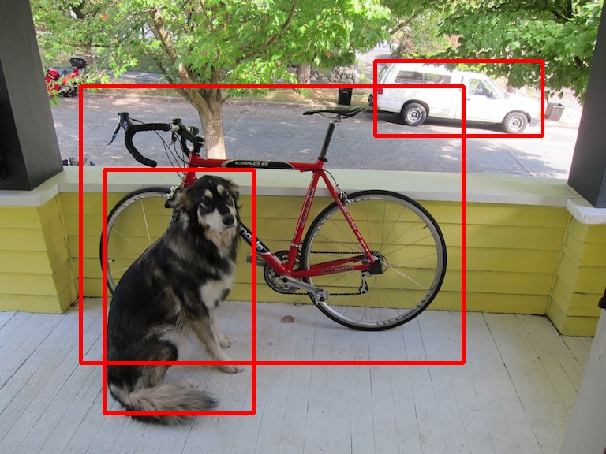

# TRTForYolov3

## Desc

    tensorRT for Yolov3


	
### Test Enviroments

    Ubuntu  16.04
    TensorRT 4.0.1.6
    CUDA 9.0

### Models

Download the caffe model converted by official model:

+ caffemodel [here](https://drive.google.com/file/d/1tVdLzBA5T_HjDQkJv2ldr99X-T_s5UMn/view)
+ prototxt [here](models/mobilenet_yolov3_test.prototxt)

### Run Sample

```bash
#build source code
git submodule update --init --recursive
mkdir build
cd build && cmake .. && make && make install
cd ..
```
#for mobilenet-yolov3-608
```
> sh demo.sh
```
### Performance

Model | GPU | Mode | Inference Time
-- | -- | -- | -- 
mobilenet-yolov3-608 |  GTX 1080 | float32 | 12.655ms
mobilenet-yolov3-608 |  Jetson nano | float32 | 247.655ms
mobilenet-yolov3-lite-320 |  Jetson nano | float32 | 114.055ms
mobilenet-yolov3-lite-320 |  Jetson nano | float16 | 97.189 ms

* The performance in jetson nano was not satisfactory , I will try to optimize it 

### Details About Wrapper

see link [TensorRTWrapper](https://github.com/lewes6369/tensorRTWrapper)
